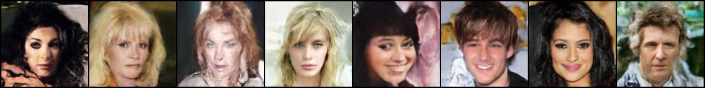
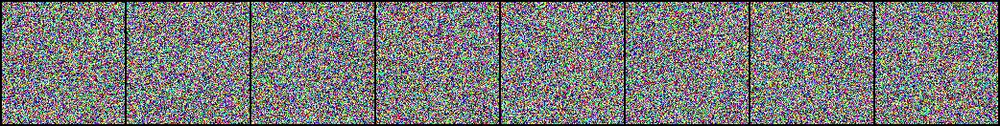
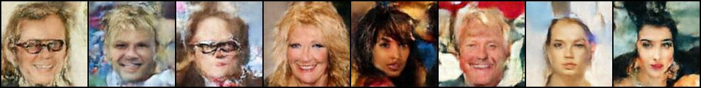
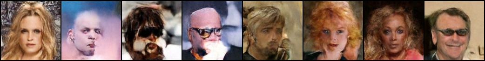

# FaceForge — Attribute-Conditioned Face Generation with Diffusion

A conditional DDPM trained from scratch on CelebA at 128×128. You pick attributes — gender, age,
hair colour, glasses, facial hair — and it generates faces matching them, using classifier-free
guidance to control how strongly the request is enforced.

**Live demo:** [diffusion-app.proudbay-827b9367.centralindia.azurecontainerapps.io](https://diffusion-app.proudbay-827b9367.centralindia.azurecontainerapps.io/)



*Samples at epoch 490. Each image is conditioned on a different randomly-drawn attribute combination.*

---

## Results

Training progression on the conditional model (fixed seed per epoch, so improvement is visible
rather than just fresh random faces):

| Epoch | Samples |
|---|---|
| 0 |  |
| 100 |  |
| 250 |  |
| 490 |  |

The full per-10-epoch progression is in [`results/FaceForge_Conditional_v2/`](results/FaceForge_Conditional_v2/).

---

## Metrics

Measured on the epoch-499 checkpoint with the full 1000-step reverse process, no guidance
(`guidance_scale = 1.0`), against real CelebA images:

| Metric | Model | Real-vs-real floor | Notes |
|---|---|---|---|
| FID ↓ | **108.95** | 41.11 | at N=512 |
| KID ↓ | **0.0772** ± 0.0021 | 0.0001 ± 0.0005 | at N=512 |
| Inception Score ↑ | **2.57** ± 0.12 | 3.54 ± 0.35 | at N=512 |

### Reading these numbers honestly

**FID is biased upward at small sample counts**, and N=512 is well below where it stabilises. To
quantify how much of the score is measurement artifact rather than model quality, `metrics.py`
has a `--real-baseline` mode that scores real images against a *disjoint set of real images* —
the floor a perfect generator could not beat:

| Samples | FID floor | KID floor |
|---|---|---|
| 512 | 41.11 | 0.00011 |
| 2048 | 14.07 | −0.00000 |

So of the model's FID 108.95 at N=512, roughly 41 points are the sample-count floor. The
remaining gap is real, though — **KID tells the cleaner story**: it is an unbiased estimator, and
it reads ≈0.0000 for real-vs-real at every sample count while the model scores 0.0772. That is a
genuine distributional gap, so there is real room to improve; it is simply nowhere near what a
raw "FID 109" implies.

For the same reason, Inception Score is best read against the real-data ceiling rather than in
absolute terms: real CelebA images score 3.54–3.79, so the model's 2.57 is ≈70% of achievable.

> **Caveat:** the model row above is measured at N=512, which is too few for a headline FID.
> Compare FID only across runs using the same `--num-samples`. KID is unbiased and safe to
> compare across sample counts. Raw records live in [`results/metrics.jsonl`](results/metrics.jsonl).

---

## Architecture

A conditional U-Net (**21.3M parameters**) predicting the noise added at each timestep.

- **Backbone** — pre-activation residual blocks with SiLU + GroupNorm, strided-conv downsampling,
  nearest-neighbour upsample + conv (avoids the checkerboard artifacts transposed convs produce).
- **Bottleneck blocks** — channels ≥128 use a squeeze-3×3-expand (ResNet-v2 bottleneck) design.
  Full-width 3×3 convs otherwise dominate the parameter budget for little benefit, since the 1×1
  projections already carry the full channel width.
- **Attention** — self-attention only at 16×16 and 8×8. Applying it at every resolution is ~5×
  slower for no real gain.
- **Conditioning** — 10 binary CelebA attributes embedded by an MLP and summed into the timestep
  embedding, so every block sees the signal. A learned `null_cond` token represents "no
  conditioning", which is what makes classifier-free guidance possible.
- **Output** — zero-initialised 1×1 conv with no activation, since the target is noise ~ N(0,1).

### Attributes

| Category | Attributes |
|---|---|
| Gender | `Male` (off = female) |
| Age | `Young` (off = old) |
| Hair | `Black_Hair`, `Blond_Hair`, `Brown_Hair`, `Bald` |
| Facial hair | `Mustache`, `Goatee` |
| Other | `Smiling`, `Eyeglasses` |

CelebA's `-1/1` encoding is remapped to `0/1`. The canonical ordering is
`dataset.SELECTED_ATTRIBUTES` — attribute vectors must always follow it.

### Diffusion setup

- 1000 noise steps, **cosine** schedule (Nichol & Dhariwal) — destroys information more gradually
  than linear, which helps at lower resolutions.
- **Min-SNR-γ loss weighting** (γ=5, Hang et al. ICCV 2023) — downweights low-noise timesteps that
  have a hard floor on achievable loss and would otherwise dominate the gradient.
- **EMA** of model weights (decay 0.999) for sampling; noticeably cleaner than the live weights.
- **Classifier-free guidance** with 10% conditioning dropout during training.
- Cosine-annealed learning rate over the full run.

---

## Usage

### Training

Single GPU:

```bash
python train.py
```

Multi-GPU via `DistributedDataParallel` — put your config in a script and launch with `torchrun`
(one process per GPU):

```bash
torchrun --nproc_per_node=2 train_ddp.py
```

> Multi-GPU cannot be launched from a Jupyter notebook: `mp.spawn` cannot pickle notebook-defined
> objects or re-import the kernel as `__main__`. `train.py` detects this and falls back to a
> single GPU with a warning rather than crashing.
>
> Under DDP, `batch_size` is **per-GPU**, not total.

### Generating faces

A Gradio web UI with attribute checkboxes, guidance control, and a fast/quality sampler toggle:

```bash
python app.py
```

Or generate from a script with `predict.py`.

### Evaluating

```bash
python metrics.py --checkpoint models/faceforge_checkpoint.pth.tar --num-samples 2048
```

Key flags:

| Flag | Default | Purpose |
|---|---|---|
| `--ddim-steps` | `0` | `0` = full 1000-step process (the number to report). Set `50` for a ~20× faster DDIM approximation. |
| `--num-samples` | `2048` | 10k+ for a headline FID. Compare FID only across equal values. |
| `--guidance-scale` | `1.0` | Higher improves attribute adherence but usually worsens FID by reducing diversity. |
| `--real-baseline` | off | Score real vs. disjoint real to get the FID floor at this sample count. |
| `--output` | `results/metrics.jsonl` | Runs are appended as JSON Lines so they accumulate. |

---

## Sampling: DDIM vs. full

`Diffusion.sample()` runs the full 999-step ancestral process; `Diffusion.sample_ddim()` walks a
strided subsequence (~50 steps) for roughly **20× faster** generation. The Gradio app defaults to
DDIM for interactive use and offers full sampling for final batches.

Both clip the implied `x0` estimate to the valid data range **at every step**. This is not
optional: the reverse step divides by `sqrt(alpha_hat)`, which is smallest — most ill-conditioned
— at high noise levels. Without per-step clipping, prediction error there is amplified and
compounds multiplicatively across hundreds of sequential steps, saturating the output to solid
colour blocks instead of converging to an image.

---

## Repository layout

| File | Purpose |
|---|---|
| `model.py` | U-Net, diffusion process, ancestral + DDIM samplers |
| `train.py` | Training loop, DDP/torchrun support, EMA, checkpointing |
| `train_ddp.py` | Multi-GPU launcher config for `torchrun` |
| `dataset.py` | CelebA dataset, attribute parsing, conditioning helpers |
| `utils.py` | Data loading, distributed sampler, EMA, checkpoint I/O |
| `metrics.py` | FID / KID / Inception Score evaluation |
| `app.py` | Gradio web UI |
| `predict.py` | Scripted generation |
| `kaggle_train_faceforge.ipynb` | Kaggle (T4 ×2) training notebook |

---

## Dataset

[CelebA](https://www.kaggle.com/datasets/jessicali9530/celeba-dataset) — 202,599 aligned face
images. Images are 178×218 and are centre-cropped to a square **before** resizing; resizing
straight to a square squashes every face vertically by ~22%. Horizontal flips are used as
augmentation.

## References

- Ho et al., [Denoising Diffusion Probabilistic Models](https://arxiv.org/abs/2006.11239) (2020)
- Nichol & Dhariwal, [Improved DDPM](https://arxiv.org/abs/2102.09672) (2021) — cosine schedule
- Ho & Salimans, [Classifier-Free Diffusion Guidance](https://arxiv.org/abs/2207.12598) (2022)
- Song et al., [Denoising Diffusion Implicit Models](https://arxiv.org/abs/2010.02502) (2021)
- Hang et al., [Efficient Diffusion Training via Min-SNR Weighting](https://arxiv.org/abs/2303.09556) (ICCV 2023)
